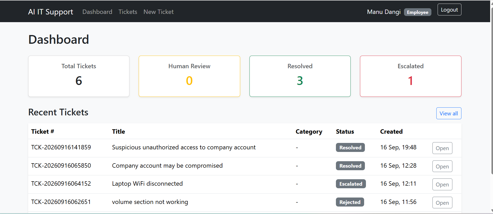
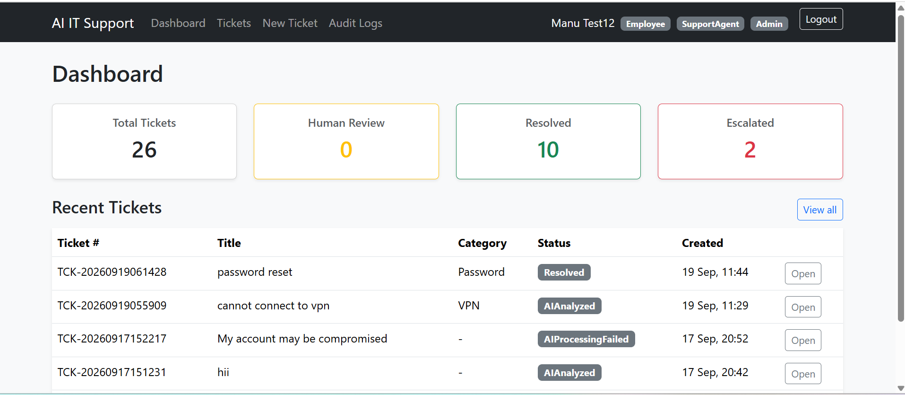
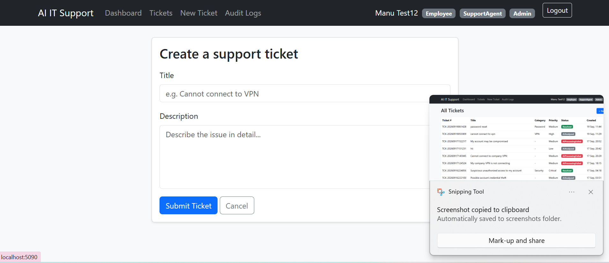
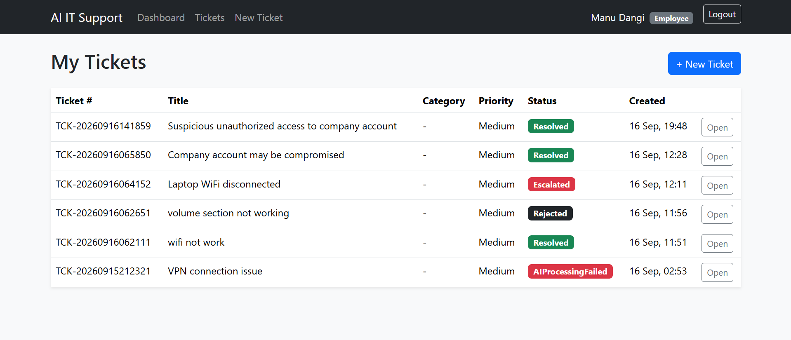
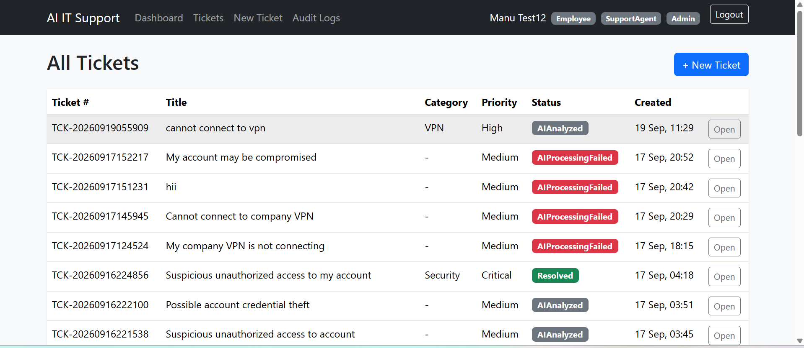
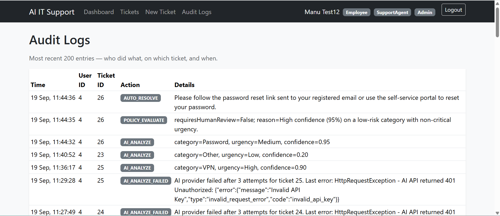
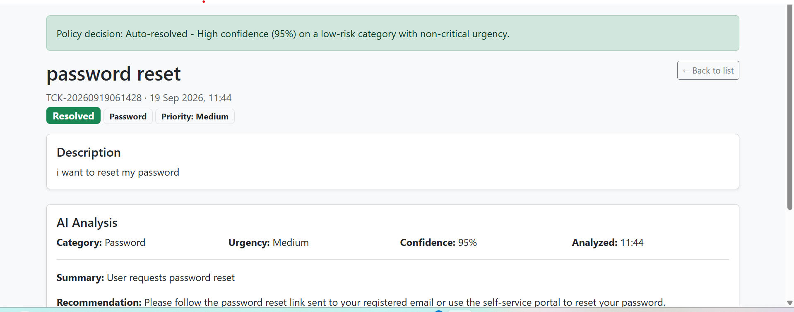

# 🤖 AI-Powered IT Support Resolution Platform

A full-stack **AI-powered IT Support Resolution Platform** built with **ASP.NET Core 8**, **Entity Framework Core**, **JWT Authentication**, and an intelligent **AI-assisted ticket resolution workflow**.

The platform helps organizations manage IT support requests through AI-powered ticket classification, automated policy evaluation, human approval workflows, and audit logging.

---

## 🚀 Project Overview

This project is designed using **Clean Architecture** principles and consists of a backend REST API and a separate MVC frontend application.

### ✨ Key Features

* 🔐 Secure JWT Authentication
* 👥 Employee, Support Agent, and Admin roles
* 🎫 Ticket Management System
* 🤖 AI-powered Ticket Analysis
* 📋 Rule-Based Policy Engine
* ✅ Human-in-the-Loop Approval Workflow
* 📝 Audit Logging
* 📚 Swagger API Documentation
* 🗄 SQL Server LocalDB Integration

---

## 📸 Application Screenshots

### Employee Dashboard



### Admin Dashboard



### Create Ticket



### Employee Ticket View



### All Tickets Dashboard



### Audit Logs



### Swagger API



---

## 🏗 System Architecture

```text
Frontend (ASP.NET MVC)
        │
        ▼
Backend REST API (ASP.NET Core 8)
        │
        ▼
Business Layer (Application)
        │
        ▼
Domain Layer
        │
        ▼
Infrastructure Layer
        │
        ▼
SQL Server LocalDB
```

---

## 🛠 Tech Stack

| Technology            | Purpose              |
| --------------------- | -------------------- |
| ASP.NET Core 8        | Backend API          |
| ASP.NET MVC           | Frontend             |
| C#                    | Programming Language |
| Entity Framework Core | ORM                  |
| SQL Server LocalDB    | Database             |
| JWT                   | Authentication       |
| Swagger               | API Testing          |
| Serilog               | Logging              |
| BCrypt                | Password Hashing     |

---

## 📂 Repository Structure

```text
AI-Powered-IT-Support-Platform
│
├── backend
│   ├── src
│   ├── tests
│   ├── screenshots
│   └── README.md
│
├── frontend
│   ├── Controllers
│   ├── Views
│   ├── Services
│   └── README.md (optional)
│
└── README.md
```

---

## ⚙️ Installation

### Clone the repository

```bash
git clone https://github.com/ManuDangi/AI-Powered-IT-Support-Platform.git
cd AI-Powered-IT-Support-Platform
```

### Backend Setup

```bash
cd backend
dotnet restore
dotnet run --project src/AIITSupport.API
```

### Frontend Setup

```bash
cd frontend
dotnet restore
dotnet run
```

---

## 🔑 Authentication Flow

1. Register a new user.
2. Login using JWT Authentication.
3. Access protected endpoints using the JWT token.
4. Manage tickets based on assigned role.

---

## 🎫 Ticket Resolution Workflow

1. Employee creates a support ticket.
2. AI analyzes ticket category and urgency.
3. Policy Engine evaluates confidence and business rules.
4. Ticket is auto-resolved or sent for human review.
5. Support Agent/Admin approves, rejects, or escalates.
6. Audit logs record every important action.

---

## 📚 Backend Documentation

Detailed API documentation is available inside:

📁 `backend/README.md`

---

## 🧪 Testing

```bash
cd backend
dotnet test
```

---

## 🔒 Security

Secrets such as JWT keys and AI API keys are stored using **.NET User Secrets** and are **not committed** to GitHub.

---

## 📈 Future Enhancements

* Docker & Docker Compose
* CI/CD with GitHub Actions
* Email Notifications
* AI Evaluation Dashboard
* React/Angular Frontend

---

## 👨‍💻 Author

**Manu Dangi**

* GitHub: https://github.com/ManuDangi
* Project: AI-Powered IT Support Resolution Platform
